## Web Lab2

组员：

陆文博	PB22000135

岳梓烨	PB22000159

陈禾一	PB22000176

### 实验流程

在本次实验中，我们首先需要根据实验一中提供的电影 ID 列表，匹配获得 Freebase 中对应的实体。

因此我们先建立电影的id和电影实体名称的映射，并创建和初始化第一跳子图三元组的集合Graph：

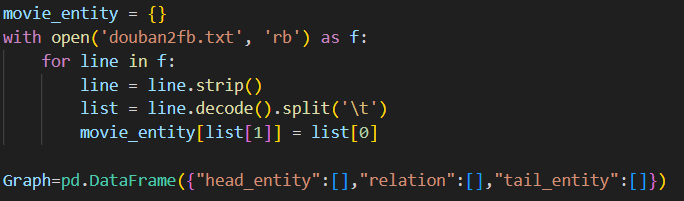

然后读取freebase的数据集，将头实体是电影实体的三元组加进Graph中，同时确保三元组的每个实体都以" http://rdf.freebase.com/ns/ "字符串开头，来保证图谱的质量：

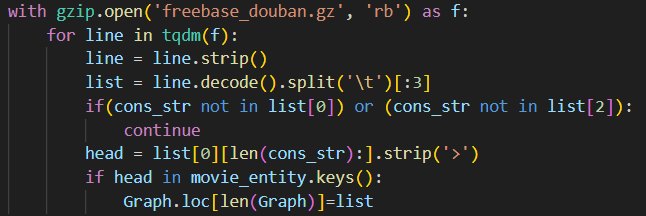

由于第一跳实体符合上述条件的不多，故可以直接在循环中用    Graph.loc[len(Graph)]=list   直接添加到Graph中。

由此我们初步得到了第一跳的子图，接下来我们分别对其头尾实体和关系进行计数：

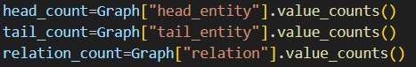

然后我们采用了20核的设置，筛掉了出现次数不超过50次的头实体和尾实体 ：

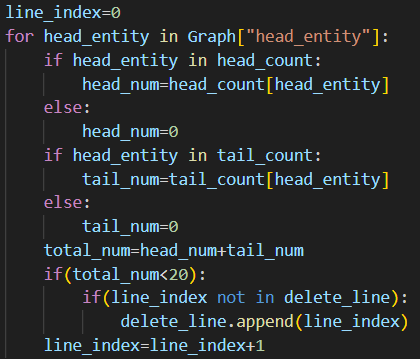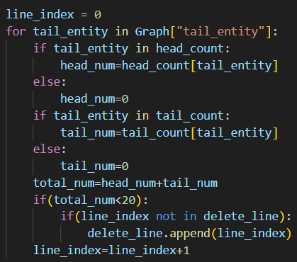

最后删掉出现次数小于50次的关系，并重置索引值：

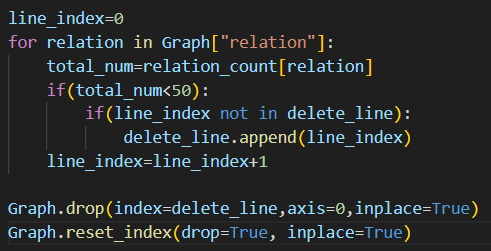

由此我们得到了由一跳生成的子图firstjump.csv。

接下来我们需要根据movie_id_map.txt提供的映射关系，将得到的子图映射为由索引值构成的三元组。

首先我们先分别得到电影实体到id，id到映射id的字典：

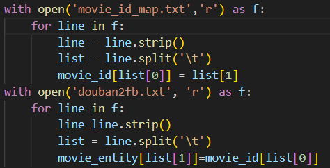

然后我们就可以对firstjump.csv生成对应的kg_final1.txt了:

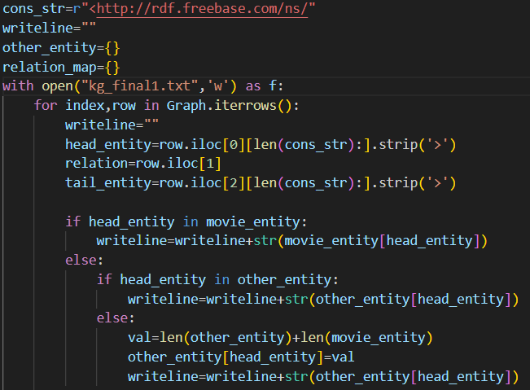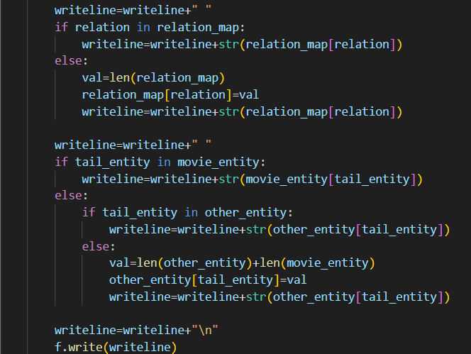

得到的kg_final1.txt的片段如图所示：

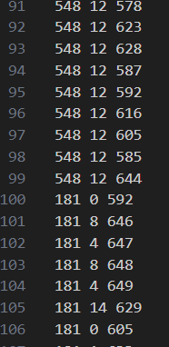

在loader_Embedding_based.py 中我按要求实现了 KG 的构建
首先为KG添加逆向三元组，即对于KG中任意三元组(h, r, t)，添加逆向三元组 (t, r+n_relations, h)，并将原三元组和逆向三元组拼接为新的DataFrame，保存在 self.kg_data 中。
根据注释，我们可以完成如下代码
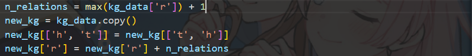
随后我们根据已有的数据计算出相关系数，实体数和三元组的数量
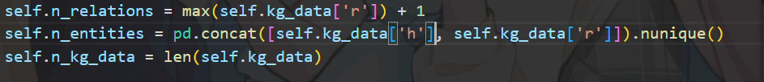
根据 self.kg_data 构建字典 self.kg_dict ，其中key为h, value为tuple(t, r)，和字典 self.relation_dict，其中key为r, value为tuple(h, t)。
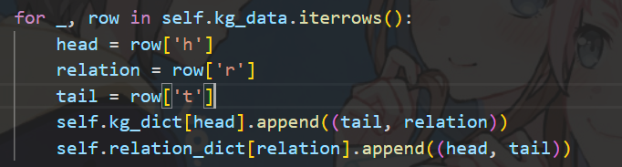

在 Embedding_based.py 中我实现 TransE 算法，代码如图
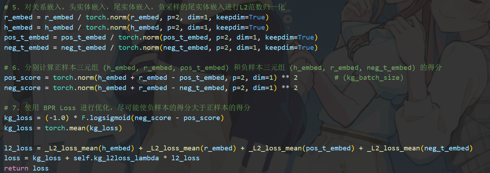
在calc_cf_loss，calc_score函数中我们尝试通过相加，逐元素乘积，拼接等方式为物品嵌入注入图谱实体的语义信息。
我们设置了一个参数method，通过在训练前修改method的值来实现不同的注入信息方式。
特别要注意的是，拼接的方法会导致的矩阵的维度发生变化，在代码处理的时候注意对齐。
calc_cf_loss函数
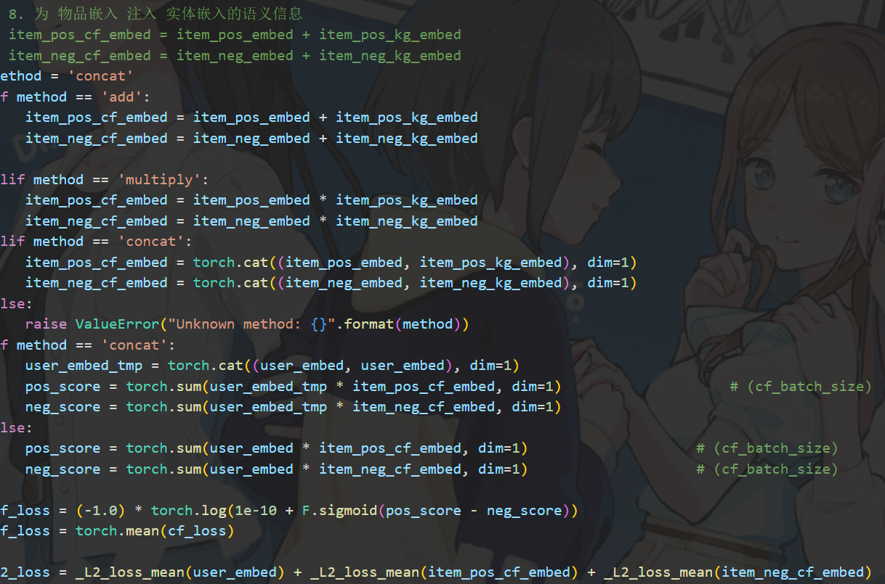
calc_score函数
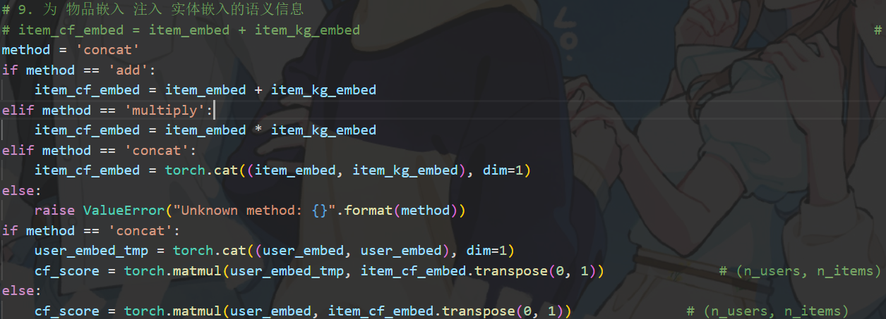

<h2>模型效果评估</h2>

在本次实验中，我们主要使用召回率（$Recall$）和归一化折损累计增益（$NDCG$）来对模型的搜索推荐结果进行评估。

<h4>召回率</h4>

召回率是用于评估推荐系统或分类系统完整性的一种指标。它衡量系统推荐或预测的相关项目占所有相关项目的比例。具体来说，由如下公式计算：
$$
Recall = /frac{推荐的项目数量}{所有相关项目的总数量}
$$
Recall的取值在0至1的区间以内，呈现为越高越好。高召回率表示该推荐系统可以推荐大多数的相关项目，推荐结果更为全面。

<h4>归一化折损累计增益</h4>

归一化折损累计增益根据搜素结果推荐结果中的顺序来计算，用于评估推荐结果的质量，与排名靠前的高相关性结果有关。

计算公式如下：
$$
NDCG@k = /frac{DCG@k}{IDCG@k}
$$
其中DCG计算公式为$$DCG@k=/Sigma_{i=1}^{k}/frac{rel_i}{log_2(i+1)}$$，分子为相关性分数，而IDCG则为理想的DCG数值。

DCG的两个性能包括：1.高关联度的结果比一般关联度的结果更影响最终的指标得分。

2.有高关联度的结果出现在更靠前的位置的时候，指标会越高。

NDCG的值越高，说明推荐系统的整体性能越好，推荐的结果质量越高。

<h4>结果及其分析</h4>

运行结果：

篇幅原因，保存在analysis文件夹的系列tsv文件内。

基础MF方法：base.tsv

使用一跳子图的TransE算法（使用相加进行语义信息的注入）：transe_1_add.tsv

使用一跳子图的TransE算法（使用逐元素乘积进行语义信息的注入）：transe_1_mul.tsv

使用一跳子图的TransE算法（使用拼接进行语义信息的注入）：transe_1_joint.tsv

<h5>基础MF方法与TransE算法的对比</h5>

可以看到，这四种性能指标随着epoch轮数的递增，总体上都呈现出先上升后下降的趋势，这与深度学习的一般性规律是一致的。

一个 **epoch** 表示模型对**整个训练集**进行一次完整的遍历，即所有样本都经历一次前向传播和反向传播的训练过程。一般来说epoch影响的是模型的拟合与过拟合，在一定轮数内，模型通过遍历一次数据集计算误差、更新其参数，提高性能。但epoch过多会导致过拟合的情况，使模型过多地学习到数据的细节信息，反而导致性能下降。

Recall@5明显小于Recall@10，这是由于Recall的计算机制所致，Top-10的推荐内容理应比Top-5更能涵盖相关内容。

另外NDCG@5大致大于NDCG@10，可能是随着k的增加，在后部引入了相关性较差的结果。

另外在两种策略（基础的MF、使用相加嵌入的TransE）的性能比较上，我们观察到当epoch相等时两个模型表现相近（甚至一些情况下基础的MF还略高一些），但在epoch相关的峰值性能上，基本上有TransE略优于MF。

融合TransE算法的推荐并没有获得非常明显的提升，可能的原因有：

1.仅使用了一跳形成的子图，而对于578个实体而言一跳的语义信息可能并不是很丰富，其中的关联性也较差（总体上而言就是图谱的质量不佳），也许使用二跳或是更高次数的子图可以提升其效果。

2.相加的嵌入方式可能不是最优的（虽然在下文的分析中，已经是所采取嵌入方法中较为优秀的方法）

3.模型外部的配置可能有所影响。在模型参数的配置方面，我们只探索了epoch对模型性能的影响，实际上还有若干其他参数，诸如batch size、learning rate、计算loss时的lambda等等。这些参数共同决定了模型训练的性能，或许在另外一套参数设置下融合TransE算法的MF推荐机制会有明显更好的性能。

<h5>TransE算法中嵌入知识图谱的对比</h5>

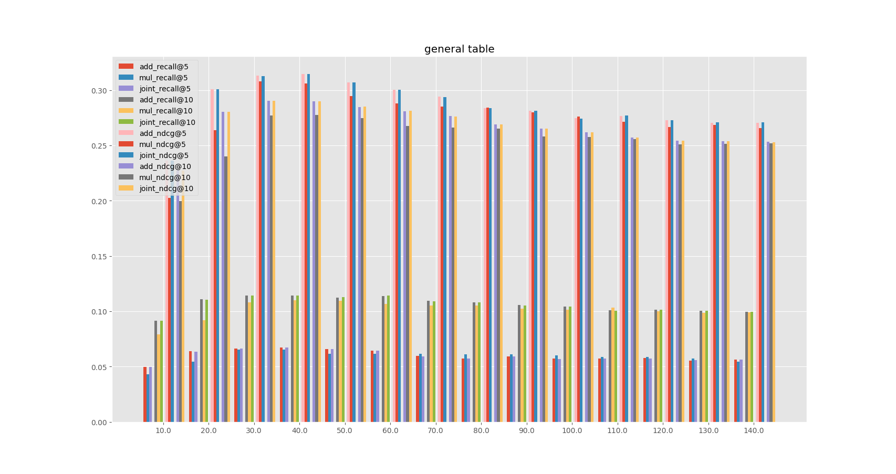

总体上，随着epoch先升后降的特征，以及指标间的大小关系大致相同，不再赘述。

每三列条状表征三种策略对应的一种指标，顺序分别为（相加、累乘、拼接）。

然而非常明显的一点是，相加策略与拼接策略的性能基本上相平，而累乘策略的性能（在NDCG与大部分情况的recall指标下）明显劣于另外两种策略。

造成这种差异的原因可能来源于运算的差异。

相加与拼接策略表现出非常接近的性能，也许是因为相加与拼接操作本就较为相似（在保留与融合信息方面具有相近的性能，不过个人认为拼接操作有助于保存更多的细节信息），也有可能是该实验条件下的特定结果。

相加和拼接操作在直观上都具备线性关系，也许在向量上可以更好地表示实体与语义信息之间的联系，而累乘则较不稳定且缺乏直观解释。同时由于乘法本身的机制，在计算中向量中的数据噪声也一并累乘，使得噪声更加显著，对结果的影响更大。

